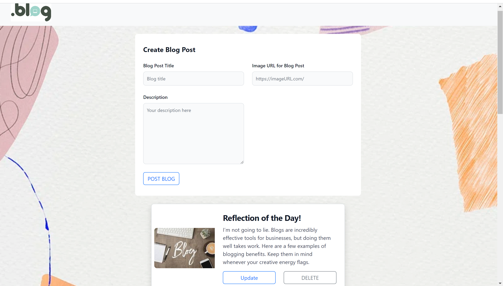

# Blog Posts Personal CRUD

Allow your users to post their own blogs quickly.

## Tech Stack

**Client:** HTML/CSS, EJS, Javascript, Flowbite, TailwindCSS

**Server:** Node, Express


## Features

- Create your own blog by filling out the form and selecting "Post Blog"
- Scroll down to read your past blogs
- Update the content of a past blog by selecting the "Update" button on the respective blog
- Delete a blog by selecting "Delete" on the blog


## App Screenshot




## Run Locally

Clone the project

```bash
  git clone https://github.com/socratic617/personal-express-complete.git
```

Go to the project directory

```bash
  cd personal-express-complete
```

Install dependencies

```bash
  npm install
```

Start the server

```bash
  npm start
```


## Lessons Learned

I learned the basic fundamentals of CRUD. I learned how to think about edge cases to improve my user experience. I also learned how to use ObjectId to make it easy to find by blogs when i needed to update and delete them. I also learned more about how to leverage Flowbite(TailwindCSS) to give a cleaner look for my users.

